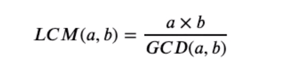

# GCD 와 LCM

- Greatest Common Divider 와 Least Common Multiple
  최대공약수 / 최소공배수를 묻는 문제의 90%이상은 이 알고리즘을 사용한다.

- 최소공배수의 경우에는 다음과 같은 식으로 풀 수 있으므로 최대 공약수만 알면 된다.



- 최대 공약수 구하는 방법 3가지
  - 단순 반복문으로 하는 방법
  - 유클리드 호제법을 이용한 방법
  - 라이브러리를 활용한 방법
  
- 유클리드 호제법 : GCD(a, b) = GCD(b, a%b)

```python
    # 방법1 : 단순하게 반복문 사용
    def gcd_native(a, b):
        for i in range(min(a, b), 0 , -1):
           if a % i == 0 and b % i == 0: return i

    # 방법 2 - 1: 유클리드 호제법을 이용한 방법
    def gcd(a, b):
        return gcd(b, a%b) if a%b != 0 else b
    
    # 방법 2 -2 : 반복문으로 변경
    def gcd2(a, b):
        while a % b != 0: a, b = b, a%b
        return b
    
    # 방법 3 : math의 gcd 사용하기
    import math
    math.gcd(1,2)
```